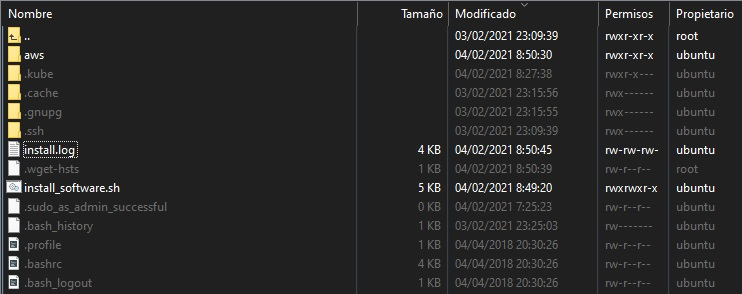
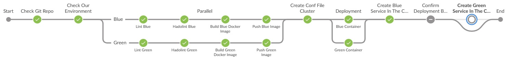
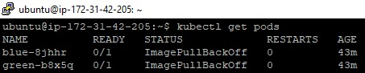
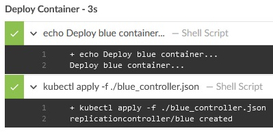
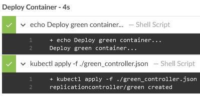
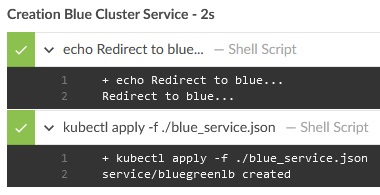

# Capstone Cloud DevOps Project Starter Code

In this project we will apply the skills and knowledge which were developed throughout the Cloud DevOps Nanodegree program.

<!--more-->

[//]: # (Image References)

[image00]: ./images/capstone_project_00.jpg "Capstone"
[image01]: ./images/capstone_project_01.jpg "Capstone"
[image02]: ./images/capstone_project_02.jpg "Capstone"
[image03]: ./images/capstone_project_03.jpg "Capstone"
[image04]: ./images/capstone_project_04.jpg "Capstone"
[image05]: ./images/capstone_project_05.jpg "Capstone"
[image06]: ./images/capstone_project_06.jpg "Capstone"
[image07]: ./images/capstone_project_07.jpg "Capstone"
[image07a]: ./images/capstone_project_07a.jpg "Capstone"
[image07b]: ./images/capstone_project_07b.jpg "Capstone"
[image07c]: ./images/capstone_project_07c.jpg "Capstone"
[image07d]: ./images/capstone_project_07d.jpg "Capstone"
[image07e]: ./images/capstone_project_07e.jpg "Capstone"
[image07f]: ./images/capstone_project_07f.jpg "Capstone"
[image07g]: ./images/capstone_project_07g.jpg "Capstone"
[image08]: ./images/capstone_project_08.jpg "Capstone"
[image09]: ./images/capstone_project_09.jpg "Capstone"
[image10]: ./images/capstone_project_10.jpg "Capstone"
[image11]: ./images/capstone_project_11.jpg "Capstone"
[image12]: ./images/capstone_project_12.jpg "Capstone"
[image13]: ./images/capstone_project_13.jpg "Capstone"
[image14]: ./images/capstone_project_14.jpg "Capstone"
[image15]: ./images/capstone_project_15.jpg "Capstone"
[image16]: ./images/capstone_project_16.jpg "Capstone"
[image17]: ./images/capstone_project_17.jpg "Capstone"
[image18]: ./images/capstone_project_18.jpg "Capstone"
[image19]: ./images/capstone_project_19.jpg "Capstone"
[image20]: ./images/capstone_project_20.jpg "Capstone"
[image21]: ./images/capstone_project_21.jpg "Capstone"
[image22]: ./images/capstone_project_22.jpg "Capstone"
[image23]: ./images/capstone_project_23.jpg "Capstone"
[image24]: ./images/capstone_project_24.jpg "Capstone"
[image25]: ./images/capstone_project_25.jpg "Capstone"
[image26]: ./images/capstone_project_26.jpg "Capstone"
[image27]: ./images/capstone_project_27.jpg "Capstone"
[image28]: ./images/capstone_project_28.jpg "Capstone"
[image29]: ./images/capstone_project_29.jpg "Capstone"
[image30]: ./images/capstone_project_30.jpg "Capstone"
[image31]: ./images/capstone_project_31.jpg "Capstone"
[image32]: ./images/capstone_project_32.jpg "Capstone"
[image33]: ./images/capstone_project_33.jpg "Capstone"
[image34]: ./images/capstone_project_34.jpg "Capstone"
[image35]: ./images/capstone_project_35.jpg "Capstone"
[image36]: ./images/capstone_project_36.jpg "Capstone"
[image37]: ./images/capstone_project_37.jpg "Capstone"
[image38]: ./images/capstone_project_38.jpg "Capstone"
[image39]: ./images/capstone_project_39.jpg "Capstone"
[image40]: ./images/capstone_project_40.jpg "Capstone"
[image41]: ./images/capstone_project_41.jpg "Capstone"


---

The summary of the files and folders within repo is provided in the table below:

| File/Folder              | Definition                                                                                                   |
| :----------------------- | :----------------------------------------------------------------------------------------------------------- |
| capstoneblue/*           | Folder containing all the necessary software (blue) to be deployment in the cluster.                         |
| capstonegreen/*          | Folder containing all the necessary software (green) to be deployment in the cluster.                        |
| cloudformation/*         | Folder containing the script that will execute the code for the creation of the cluster.                     |
| documents/*              | Folder containing all the documentation of the different installations for the realisation of this project.  |
| images/*                 | Folder containing the images of the project.                                                                 |
|                          |                                                                                                              |
| blue_controller.json     | Contains code to create a replication controller for blue.                                                   |
| blue_service.json        | Contains the code for the creation of the service for blue.                                                  |
| green_controller.json    | Contains code to create a replication controller for green.                                                  |
| green_service.json       | Contains the code for the creation of the service for green.                                                 |
| install_software.sh      | Contains the code for the installation of all the software needed for this project.                          |
| Jenkinsfile              | Contains the script where the Jenkins pipeline has been defined.                                             |
|                          |                                                                                                              |
| README.md                | Contains the project documentation.                                                                          |


---

## [Rubric Points](https://review.udacity.com/#!/rubrics/2577/view)
### Here I will consider the rubric points individually and describe how I addressed each point in my implementation. 

---

### Project Specifications

In this project you will apply the skills and knowledge which were developed throughout the Cloud DevOps Nanodegree program. These include:

- Working in AWS
- Using Jenkins or Circle CI to implement Continuous Integration and Continuous Deployment
- Building pipelines
- Working with Ansible and CloudFormation to deploy clusters
- Building Kubernetes clusters
- Building Docker containers in pipelines

As a capstone project, the directions are rather more open-ended than they were in the previous projects in the program. You will also be able to make some of your own choices in this capstone, for the type of deployment you implement, which services you will use, and the nature of the application you develop.

You will develop a CI/CD pipeline for micro services applications with either blue/green deployment or rolling deployment. You will also develop your Continuous Integration steps as you see fit, but must at least include typographical checking (aka “linting”). To make your project stand out, you may also choose to implement other checks such as security scanning, performance testing, integration testing, etc.!

Once you have completed your Continuous Integration you will set up Continuous Deployment, which will include:

- Pushing the built Docker container(s) to the Docker repository (you can use AWS ECR, create your own custom Registry within your cluster, or another 3rd party Docker repository) ; and
- Deploying these Docker container(s) to a small Kubernetes cluster. For your Kubernetes cluster you can either use AWS Kubernetes as a Service, or build your own Kubernetes cluster. To deploy your Kubernetes cluster, use either Ansible or Cloudformation. Preferably, run these from within Jenkins or Circle CI as an independent pipeline.


## Prerequisite

1. Create a Github account with our project's code repository.
2. Create an AWS account for the IAM users with appropriate roles and permissions, creation of the key pair, for the creation of the EC2 instance with its own default VPC and for the creation of the EKS cluster.
3. Create a Docker account to use the hub to create our containers with our application to deploy.
4. Create an EC2 instance. [According to the EC2 instance creation manual](https://github.com/Abhaycl/Capstone_Cloud_DevOps/tree/main/documents/EC2Creation/README.md)
5. Configure the connection to the instance created in EC2. [According to the manual connection with the EC2 instance](https://github.com/Abhaycl/Capstone_Cloud_DevOps/tree/main/documents/EC2Connect/README.md)


### Necessary Software

- Git
- Java
- Jenkins
- Docker
- Tidy
- Hadolint
- Unzip
- Awscli
- Kubectl
- Eksctl

For the installation of all necessary software we have created the file _install_software.sh_ which contains all the commands to install and configure the software on our EC2 instance.

There are several ways to copy our files to our EC2 instance such as:

- Download them from our repository.

```
    git clone https://github.com/Abhaycl/Capstone_Cloud_DevOps ./
```

- Copy it from our own machine.

```
    scp -i jenkins-key-pair-us-west-2.pem install_software.sh ubuntu@servidor.compute.amazonaws.com:/home/ubuntu/
    scp -i jenkins-key-pair-us-west-2.pem eks_cluster* ubuntu@servidor.compute.amazonaws.com:/home/ubuntu/
```

- Copy it from an S3 bucket that you have configured.

```
    aws s3 cp s3://Abhay_Capstone_Cloud_DevOps/install_software.sh ./
    aws s3 cp s3://Abhay_Capstone_Cloud_DevOps/eks_cluster* ./
```

We have chosen to copy it directly from our machine, giving it the necessary execution permissions. Which we copy to our EC2 instance and run it as:

```
    ./install_software.sh
```

![alt text][image02]

This file will create a series of necessary folders of the different installations and an install.log file.

<p align="center">
    
</p>

The file described above will indicate the version of the installed software, if any reference is missing, it will indicate that something is wrong.

![alt text][image04]


## Steps I have followed to complete the project

I have created a series of separate manuals of all the steps I have followed to complete the various tasks required for the project, for provide clarity on each thema covered. These guides are in the links above. This is so that I can focus more on the steps followed in the project requirements.


---


**Step 1:** Propose and Scope the Project

- Plan what your pipeline will look like.

In the design of our pipeline, I show a clear labelling, so that it is easily recognisable, which tasks belong to a continuous integration and which other parts belong to a continuous deployment, leaving a final task to the choice of the deploying user for balancing, so that we can see what happens in our AWS Kubernetes (EKS cluster) which we use as a service.

![alt text][image00]

- Decide which options you will include in your Continuous Integration phase.

 For the continuous integration part I have decided to integrate the checking of our repository (git), the checking of the versions of our applications used by our environment, the checking of the code of our application (lint) and the checking of the code that will generate our images (hadolint).

- Use Circle CI or Jenkins.

I have decided to use Jenkins software as my automation server, which is installed and configured on an EC2 instance of AWS.

- Pick a deployment type - either rolling deployment or blue/green deployment.

For the type of deployment I have decided to implement a blue/green type of deployment because enables deploying new code to environments while keeping the existing environment up until the new environment is ready. This is important for providing a consistently working environment to the end users of the code/website. In addition, it allows us to independently test the new environment before putting it in front of the end user. To accomplish blue green deployment it requires setting up this identical environment, switching the load balancer, and verifying that the code base has changed through the website.

<p align="center">
    
</p>

For my project I will redirect the traffic from my blue container to my green container.

- For the Docker application you can either use an application which you come up with, or use an open-source application pulled from the Internet, or if you have no idea, you can use an Nginx “Hello World, my name is (student name)” application.

I'm going to use Nginx as my container application, because that's where my website will be hosted (index.html and background.jpg files). 


---


**Step 2:** Use Jenkins or Circle CI, and implement blue/green or rolling deployment.

- If you're using Jenkins, create your Jenkins master box and install the plugins you will need. If you're using Circle CI, set up your circle CI account and connect your git repository.

In the following link we describe the tasks carried out to complete each of the sections of this step. [Instalation and configure Jenkins application](https://github.com/Abhaycl/Capstone_Cloud_DevOps/tree/main/documents/Jenkins/README.md)

- Set up your environment to which you will deploy code.

We create a Docker .account to use the hub where we can see our uploaded images.

![alt text][image05]

In the file ```Jenkinsfile``` is all the coding of the steps to execute in our pipeline and in the files ```Dockerfile``` contains all the instructions to create our images. Also, all the installations and configurations mentioned above.


---


**Step 3:** Pick AWS Kubernetes as a Service, or build your own Kubernetes cluster.

- Use Ansible or CloudFormation to build your “infrastructure”; i.e., the Kubernetes Cluster.

I used CloudFormation with a template to create the EKS cluster but to automate the task in an independent pipeline it was better to create shell script files, one to create the cluster (file ```eks_cluster_create.sh```) and one to delete the cluster (file ```eks_cluster_delete.sh```).

In this setup we’ll be doing installation of an EKS Cluster running Kubernetes version 1.18 and using Managed EC2 compute nodes. These are my cluster details:

    Version: 1.18
    Region: us-west-2
    Cluster name: capstone
    Node group name: workers
    Node type: t2.micro
    Node AMI: automatic
    Total number of nodes (for a static ASG): 3
    Minimum nodes in ASG: 1
    Maximum nodes in ASG: 4

We can also use config file ```eks_cluster_create.yaml``` instead of flags to create a cluster. A way to run it would be:

```
    eksctl create cluster -f eks_cluster_create.yaml
```

- It should create the EC2 instances (if you are building your own), set the correct networking settings, and deploy software to these instances.

Not applicable, because in my case I used the docker hub to contain the images.

- As a final step, the Kubernetes cluster will need to be initialized. The Kubernetes cluster initialization can either be done by hand, or with Ansible/Cloudformation at the student’s discretion.

For a better overview and control of things happening with the creation and deletion of the cluster, I decided to create and delete it manually by executing the above mentioned shell script files. Although as I indicated they can be included in a separate pipeline.

From our EC2 instance to create our EKS cluster, we run the following script:

```
    sudo ./eks_cluster_create.sh
```

![alt text][image06]
![alt text][image07]
![alt text][image07a]
![alt text][image07b]
![alt text][image07c]
![alt text][image07d]
![alt text][image07e]
![alt text][image07f]
![alt text][image07g]

From our EC2 instance to delete our EKS cluster, we run the following script:

```
    sudo ./eks_cluster_delete.sh
```

![alt text][image08]


---


**Step 4:** Build your pipeline

- Construct your pipeline in your GitHub repository.

Location of our repository for this project. [Gitub](https://github.com/Abhaycl/Capstone_Cloud_DevOps)

In the root of our repository we have the ```Jenkinsfile``` with all the instructions for our pipeline.

[Jenkinsfile](https://github.com/Abhaycl/Capstone_Cloud_DevOps/Jenkinsfile)

- Set up all the steps that your pipeline will include.

The stages of our pipeline are:

1. Checking our repository.

![alt text][image09]

2. Checking our environment.

![alt text][image10]

3. Checking the code of our applications (lint) for the blue and green branches.

![alt text][image11]
![alt text][image12]

4. Checking the code for the creation of our images (hadolint) for the blue and green branches.

![alt text][image13]
![alt text][image14]

5. Load the configuration parameters of our cluster.

![alt text][image15]

6. Build our blue and green image.

![alt text][image16]
![alt text][image17]

7. Push our blue and green image to a registry.

![alt text][image18]
![alt text][image19]

8. Deploy our blue and green containers.

![alt text][image20]
![alt text][image21]

9. Creation of the blue service in the cluster.

![alt text][image22]

10. Confirmation by the user to make the balancing to the green container.

![alt text][image23]

Here we include the step in which the user continues with the deployment of the green service.

![alt text][image24]

And here we include the step for which the user rejects the deployment of the green service, maintaining the deployment of the blue service.

![alt text][image25]

11. Creation of the green service in the cluster.

![alt text][image26]

Pipelines executed.

![alt text][image27]

- Configure a deployment pipeline.

For the implementation of the deployment of the blue and green branches, we have created the files:

[blue_controller.json](https://github.com/Abhaycl/Capstone_Cloud_DevOps/blue_controller.json)
[green_controller.json](https://github.com/Abhaycl/Capstone_Cloud_DevOps/green_controller.json)
[blue_service.json](https://github.com/Abhaycl/Capstone_Cloud_DevOps/blue_service.json)
[green_service.json](https://github.com/Abhaycl/Capstone_Cloud_DevOps/green_service.json)

These files contain all the necessary configurations for the deployment of the blue and green branches in our EKS cluster as a service.

- Include your Dockerfile/source code in the Git repository.

Our Dockerfile files are located in our repository, in the corresponding blue and green branch folders.

[capstoneblue/Dockerfile](https://github.com/Abhaycl/Capstone_Cloud_DevOps/capstoneblue/Dockerfile)
[capstonegreen/Dockerfile](https://github.com/Abhaycl/Capstone_Cloud_DevOps/capstonegreen/Dockerfile)

- Include with your Linting step both a failed Linting screenshot and a successful Linting screenshot to show the Linter working properly.

We create a situation where our code fails when checked with lint.

![alt text][image28]
![alt text][image29]

We correct our code and relaunch the pipeline to recheck with lint that everything is correct.

![alt text][image11]


---


**Step 5:** Test your pipeline

- Perform builds on your pipeline.

We check that they are build correctly.

![alt text][image16]
![alt text][image17]

- Verify that your pipeline works as you designed it.

We check that all the tasks of each step in our pipeline are performed correctly as I expected.

![alt text][image30]
![alt text][image31]
![alt text][image32]
![alt text][image33]

- Take a screenshot of the Circle CI or Jenkins pipeline showing deployment, and a screenshot of your AWS EC2 page showing the newly created (for blue/green) or modified (for rolling) instances. Make sure you name your instances differently between blue and green deployments.

The following images show our pods, nodes, services, controllers.

<p align="center">
    
	
	
	
</p>
![alt text][image38]
![alt text][image39]

As we can see in the images above the address of the EKS cluster we created is: 

```
    a3afce1808b8c4ea4bcc7b19583efb4f-1755198212.us-west-2.elb.amazonaws.com
```

Which we use to access our website from our blue service, displaying the following:

![alt text][image40]

When we accept the redirection from our green service, it will show us the following:

![alt text][image41]