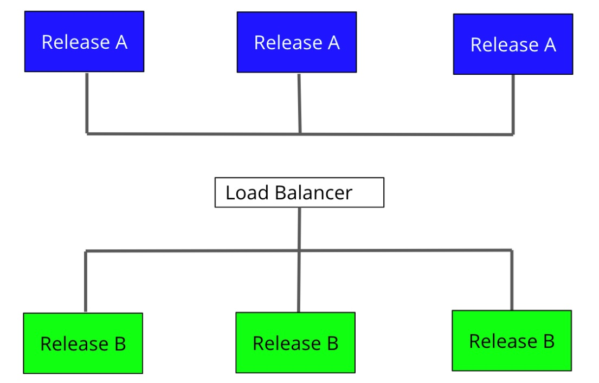

# Capstone Cloud DevOps Project Starter Code

In this project we will apply the skills and knowledge which were developed throughout the Cloud DevOps Nanodegree program.

<!--more-->

[//]: # (Image References)

[image00]: ./images/capstone_project_00.jpg "Capstone"
[image01]: ./images/capstone_project_01.jpg "Capstone"
[image02]: ./images/capstone_project_02.jpg "Capstone"
[image03]: ./images/capstone_project_03.jpg "Capstone"
[image04]: ./images/capstone_project_04.jpg "Capstone"
[image05]: ./images/capstone_project_05.jpg "Capstone"
[image06]: ./images/capstone_project_06.jpg "Capstone"
[image07]: ./images/capstone_project_07.jpg "Capstone"
[image08]: ./images/capstone_project_08.jpg "Capstone"
[image09]: ./images/capstone_project_09.jpg "Capstone"
[image10]: ./images/capstone_project_10.jpg "Capstone"
[image11]: ./images/capstone_project_11.jpg "Capstone"
[image12]: ./images/capstone_project_12.jpg "Capstone"
[image13]: ./images/capstone_project_13.jpg "Capstone"
[image14]: ./images/capstone_project_14.jpg "Capstone"
[image15]: ./images/capstone_project_15.jpg "Capstone"
[image16]: ./images/capstone_project_16.jpg "Capstone"
[image17]: ./images/capstone_project_17.jpg "Capstone"
[image18]: ./images/capstone_project_18.jpg "Capstone"
[image19]: ./images/capstone_project_19.jpg "Capstone"
[image20]: ./images/capstone_project_20.jpg "Capstone"


---

The summary of the files and folders within repo is provided in the table below:

| File/Folder              | Definition                                                                                                   |
| :----------------------- | :----------------------------------------------------------------------------------------------------------- |
| capstoneblue/*           | Folder containing all the necessary software (blue) to be deployment in the cluster.                         |
| capstonegreen/*          | Folder containing all the necessary software (green) to be deployment in the cluster.                        |
| cloudformation/*         | Folder containing the script that will execute the code for the creation of the cluster.                     |
| documents/*              | Folder containing all the documentation of the different installations for the realisation of this project.  |
| images/*                 | Folder containing the images of the project.                                                                 |
|                          |                                                                                                              |
| blue_controller.json     | Contains code to create a replication controller for blue.                                                   |
| blue_service.json        | Contains the code for the creation of the service for blue.                                                  |
| green_controller.json    | Contains code to create a replication controller for green.                                                  |
| green_service.json       | Contains the code for the creation of the service for green.                                                 |
| install_software.sh      | Contains the code for the installation of all the software needed for this project.                          |
| Jenkinsfile              | Contains the script where the Jenkins pipeline has been defined.                                             |
|                          |                                                                                                              |
| README.md                | Contains the project documentation.                                                                          |


---

## [Rubric Points](https://review.udacity.com/#!/rubrics/2577/view)
### Here I will consider the rubric points individually and describe how I addressed each point in my implementation. 

---

### Project Specifications

In this project you will apply the skills and knowledge which were developed throughout the Cloud DevOps Nanodegree program. These include:

- Working in AWS
- Using Jenkins or Circle CI to implement Continuous Integration and Continuous Deployment
- Building pipelines
- Working with Ansible and CloudFormation to deploy clusters
- Building Kubernetes clusters
- Building Docker containers in pipelines

As a capstone project, the directions are rather more open-ended than they were in the previous projects in the program. You will also be able to make some of your own choices in this capstone, for the type of deployment you implement, which services you will use, and the nature of the application you develop.

You will develop a CI/CD pipeline for micro services applications with either blue/green deployment or rolling deployment. You will also develop your Continuous Integration steps as you see fit, but must at least include typographical checking (aka “linting”). To make your project stand out, you may also choose to implement other checks such as security scanning, performance testing, integration testing, etc.!

Once you have completed your Continuous Integration you will set up Continuous Deployment, which will include:

- Pushing the built Docker container(s) to the Docker repository (you can use AWS ECR, create your own custom Registry within your cluster, or another 3rd party Docker repository) ; and
- Deploying these Docker container(s) to a small Kubernetes cluster. For your Kubernetes cluster you can either use AWS Kubernetes as a Service, or build your own Kubernetes cluster. To deploy your Kubernetes cluster, use either Ansible or Cloudformation. Preferably, run these from within Jenkins or Circle CI as an independent pipeline.

### Project Directions

**Step 1:** Propose and Scope the Project

- Plan what your pipeline will look like.
- Decide which options you will include in your Continuous Integration phase.
- Use Circle CI or Jenkins.
- Pick a deployment type - either rolling deployment or blue/green deployment.
- For the Docker application you can either use an application which you come up with, or use an open-source application pulled from the Internet, or if you have no idea, you can use an Nginx “Hello World, my name is (student name)” application.

**Step 2:** Use Jenkins or Circle CI, and implement blue/green or rolling deployment.

- If you're using Jenkins, create your Jenkins master box and install the plugins you will need. If you're using Circle CI, set up your circle CI account and connect your git repository.
- Set up your environment to which you will deploy code.

**Step 3:** Pick AWS Kubernetes as a Service, or build your own Kubernetes cluster.

- Use Ansible or CloudFormation to build your “infrastructure”; i.e., the Kubernetes Cluster.
- It should create the EC2 instances (if you are building your own), set the correct networking settings, and deploy software to these instances.
- As a final step, the Kubernetes cluster will need to be initialized. The Kubernetes cluster initialization can either be done by hand, or with Ansible/Cloudformation at the student’s discretion.

**Step 4:** Build your pipeline

- Construct your pipeline in your GitHub repository.
- Set up all the steps that your pipeline will include.
- Configure a deployment pipeline.
- Include your Dockerfile/source code in the Git repository.
- Include with your Linting step both a failed Linting screenshot and a successful Linting screenshot to show the Linter working properly.

**Step 5:** Test your pipeline

- Perform builds on your pipeline.
- Verify that your pipeline works as you designed it.
- Take a screenshot of the Circle CI or Jenkins pipeline showing deployment, and a screenshot of your AWS EC2 page showing the newly created (for blue/green) or modified (for rolling) instances. Make sure you name your instances differently between blue and green deployments.

## Prerequisite

1. Create a Github account with the project folder created.
2. Create a AWS account for the IAM, for the EC2 instance and for the EKS cluster.
3. Create a Docker account to use the hub.
4. Create an EC2 instance. [According to the EC2 instance creation manual](https://github.com/Abhaycl/Capstone_Cloud_DevOps/tree/main/documents/EC2Creation/README.md)
5. Configure the connection to the instance created in EC2. [According to the manual connection with the EC2 instance](https://github.com/Abhaycl/Capstone_Cloud_DevOps/tree/main/documents/EC2Connect/README.md)
6. Install and configure the Jenkins application with all the necessary plugins among them (Blue Ocean). [According to the manual configure Jenkins application](https://github.com/Abhaycl/Capstone_Cloud_DevOps/tree/main/documents/Jenkins/README.md)

### Necessary Software

- Git
- Java
- Jenkins
- Docker
- Tidy
- Hadolint
- Unzip
- Awscli
- Kubectl
- Eksctl

## Steps I have followed to complete the project

For installing all necessary software we have created the file install_software.sh which we copy to our EC2 instance and run it as:

```./install_software.sh```

![alt text][image00]

This file will create a series of necessary folders of the different installations and an install.log file.

<p align="center">
    
</p>

The file described above will indicate the version of the installed software, if any reference is missing, it will indicate that something is wrong.

![alt text][image02]
