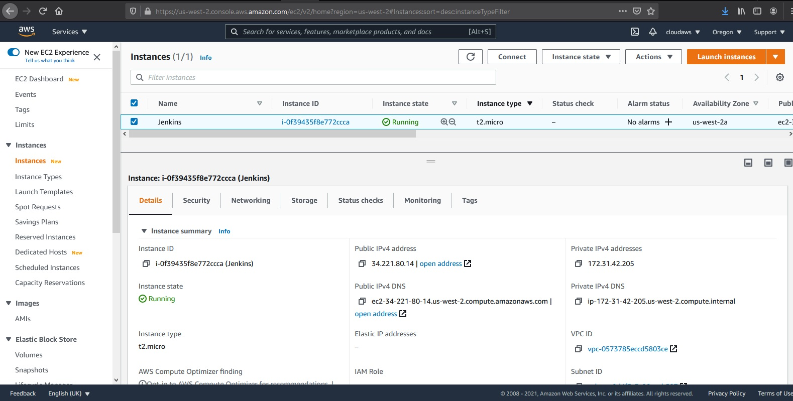
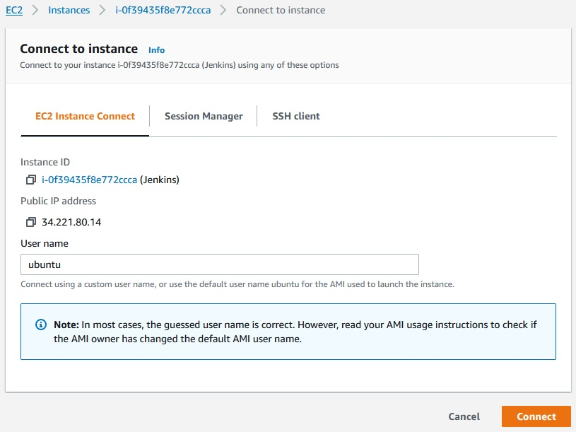
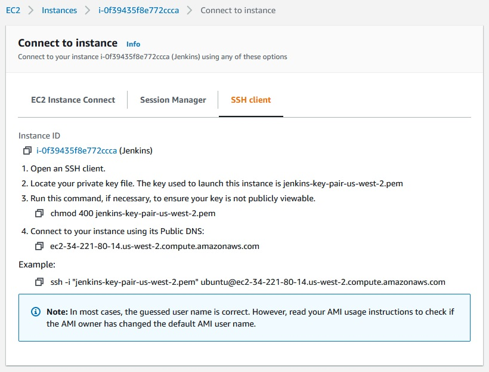
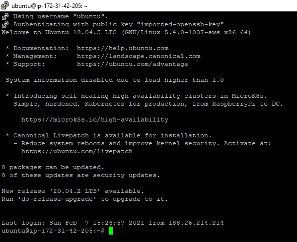
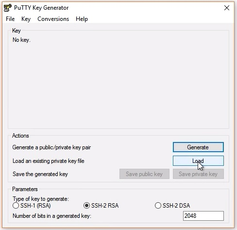
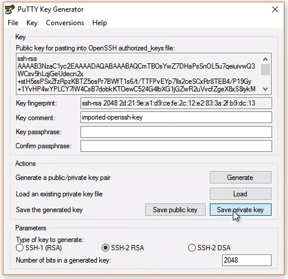
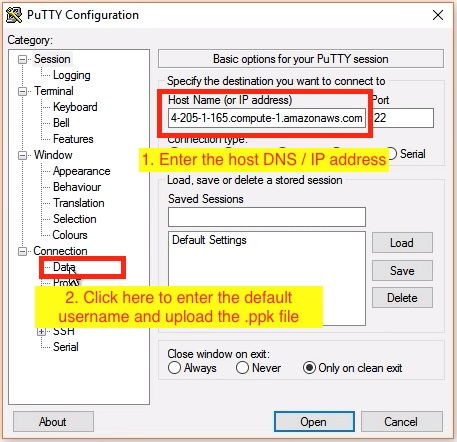
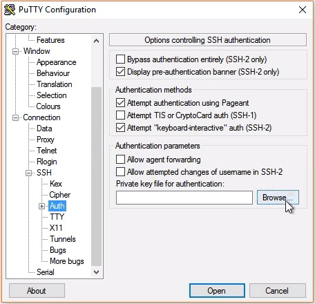
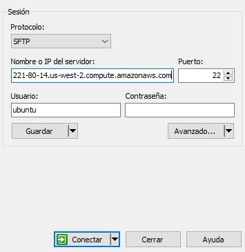

# Guide to connect to Linux EC2 instance
---
We can connect to our Linux/Ubuntu EC2 instance using the private key generated by AWS. To get started, start our instance and connect to it, as shown in the snapshot below.

---

We go to the EC2 dashboard in AWS and copy the public IP address of our Ubuntu EC2 instance.

<p align="center">
    
</p>

And we get the address:

```ec2-34-221-80-14.us-west-2.compute.amazonaws.com``` or ```34.221.80.14```

AWS has launched the EC2 Instance Connect wizard, which can help us to connect directly from the EC2 dashboard. Alternatively, we can use SSH as well.

<p align="center">
    
</p>

We can connect using the **EC2 Instance Connect** wizard.

### Linux/Mac users

Linux/Mac users can log into your EC2 instance using Secure Shell (SSH) client. The following are the steps:

<p align="center">
    
</p>

Connect using SSH. Copy the commands and follow the steps mentioned above.

1. Change the Private key file permissions

Open an SSH client/terminal. Navigate to the directory where you have your private key (.pem) file in your local machine, and change the permissions to hide it from the public for SSH to work, using the command:

```
    chmod 400 <path of private key .pem file locally>
```

2. Connect using the Public DNS

We will log-in using the default name. The default username for Ubuntu instances is ubuntu, and for Linux, it is ec2-user.

Connect to our instance using its public DNS, as

```
    ssh -i <path of private key .pem file locally> <public DNS>
```

The successful login will show us a prompt as shown in the snapshot below:

<p align="center">
    
</p>

Successful login using SSH. Notice the private IPv4 address at the prompt is ```172.31.42.205``` only for the case of the image above, this IP address is obtained from the EC2 instance dashboard.

### Windows users

Windows users can log in using PuTTY utility. The following are the steps:

1. Download, and install the PuTTY utility suite in our Windows machine from:

    https://www.chiark.greenend.org.uk/~sgtatham/putty/latest.html

2. We will need to have our PuTTY Private Key (.ppk) file locally. For this reason, we will use _PuTTYgen_ utility to convert the .pem file to .ppk format.

	- Run the _PuTTYgen_ in our machine.
	- Click **Load**, as shown in the snapshot below.
	- Browse and load the .pem key into the _PuTTYgen_ and then click on **Save private key** to save the key in .ppk format without a passphrase.

<p align="center">
    <br>
	
</p>
 
3. Run the PuTTY to connect to the EC2 instance.
4. Get the public DNS / IP address of our EC2 instance (host) from our AWS EC2 dashboard. Then, enter the public DNS / IP address of our EC2 instance (host) into the _PuTTY_. See snapshot below.

<p align="center">
    
</p>

5. Click on Connection → Data to enter the default username as ubuntu for ```ubuntu```, or ```ec2-user``` for Linux based OS.

6. Click on Connection → SSH → Auth to upload the .ppk file. See the snapshot below:

<p align="center">
    
</p>

7. If everything is set up correctly, a terminal window would open up to login into our Linux/Ubuntu EC2 instance.

In our case we use the WinSCP windows application to connect to our EC2 instance which we configure as shown in the image below with our address: ```ec2-34-221-80-14.us-west-2.compute.amazonaws.com``` or ```34.221.80.14```

<p align="center">
    <br>
	
	
</p>